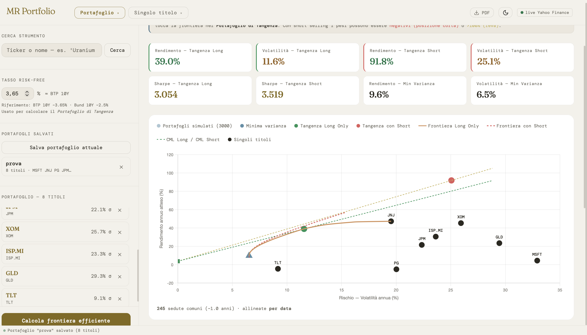
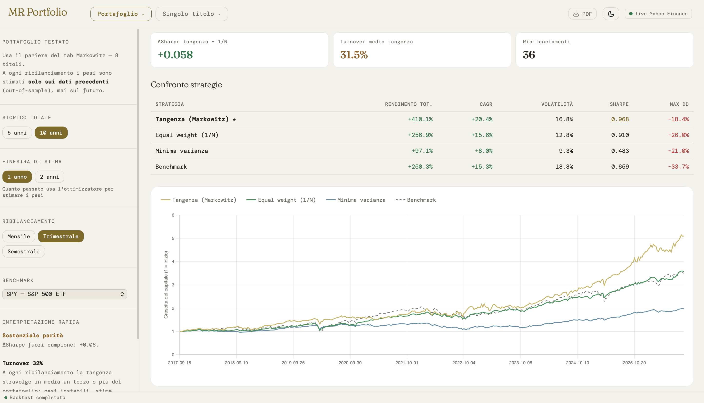
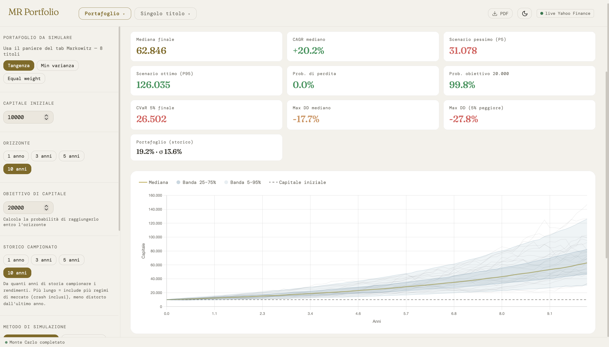
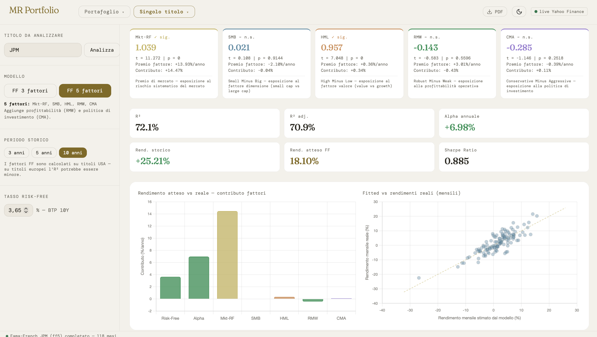

# MR Portfolio

**Costruzione e analisi di portafoglio secondo la teoria di Markowitz.**
Server Python in locale, interfaccia web a pagina singola, dati di mercato reali.

L'obiettivo non è soltanto applicare la teoria classica di portafoglio, ma
verificarne empiricamente la tenuta. Accanto all'ottimizzatore ci sono i moduli
che ne mettono alla prova le ipotesi: il test di normalità sui rendimenti, la
simulazione con code grasse e, soprattutto, il backtest fuori campione che
confronta il portafoglio ottimizzato con la banale allocazione equipesata.

> **Progetto didattico.** Non costituisce consulenza finanziaria né
> raccomandazione di investimento. I dati provengono da Yahoo Finance tramite la
> libreria `yfinance`, che non è una banca dati professionale. I risultati storici
> non sono indicativi di quelli futuri.

---

## Schermate

<!-- Carica i tuoi screenshot in una cartella docs/ del repository.
     Se cambi i nomi dei file, aggiorna i percorsi qui sotto. -->


*Frontiera efficiente, portafoglio di tangenza, minima varianza e Capital Market Line. Lo Sharpe di 3,05 è una stima in-sample sugli ultimi dodici mesi: fuori campione scende a 0,97 (vedi sotto).*


*Dieci anni, 36 ribilanciamenti trimestrali, pesi stimati solo sui dati precedenti. Tangenza contro equipesatura, minima varianza e benchmark.*


*Tremila traiettorie su dieci anni, con bootstrap dei rendimenti giornalieri storici. Da leggere con cautela: il bootstrap ricampiona il decennio 2016-2026, eccezionalmente favorevole, e questo è il motivo per cui la probabilità di perdita risulta nulla — non un'affermazione sul futuro.*


*JPMorgan sul modello a cinque fattori, 118 osservazioni mensili: beta di mercato 1,04 e caricamento HML di 0,96 — un titolo bancario si comporta da titolo value, e il modello lo vede. R² del 72%.*

---

## Avvio rapido

Serve Python 3.9 o superiore.

```bash
pip3 install numpy pandas scipy statsmodels yfinance certifi lxml
python3 server.py
```

Poi apri il browser su **http://localhost:7532**

In alternativa, su Mac `bash avvia-mac.sh` e su Windows un doppio clic su
`avvia-windows.bat` fanno partire server e browser insieme. Se lo script Mac non
parte, dagli il permesso di esecuzione una volta sola con
`chmod +x avvia-mac.sh`.

Il server resta in ascolto solo su `localhost`: non è raggiungibile dall'esterno.
Per fermarlo, `Ctrl+C` nella finestra del terminale.

---

## Architettura

Due componenti che girano interamente in locale. Un server Python espone una API
REST su `localhost`: scarica i dati di mercato da Yahoo Finance, esegue i calcoli
numerici con NumPy, SciPy, pandas e statsmodels, e restituisce JSON. Un'interfaccia
HTML a pagina singola gestisce la costruzione del paniere, la ricerca dei titoli
con autocompletamento, i grafici (Chart.js) e l'esportazione in PDF.

La separazione fra i due livelli è deliberata: il calcolo finanziario resta in
Python, dove esistono le librerie scientifiche adeguate, mentre il browser si
occupa unicamente della presentazione. Il server funge inoltre da proxy verso
Yahoo Finance, aggirando le restrizioni CORS che impedirebbero al browser di
interrogare direttamente la fonte dati.

Il backend è costruito su `http.server` della libreria standard, senza Flask né
FastAPI: l'obiettivo era capire cosa succede fra una richiesta e una risposta,
non delegarlo.

```
server.py                    Backend: API REST, tutti i calcoli
portfolio-markowitz.html     Frontend: pagina singola, nessuna dipendenza
avvia-mac.sh                 Avvio con doppio clic su Mac e Linux
avvia-windows.bat            Avvio con doppio clic su Windows
```

---

## I moduli di analisi

| Modulo | Cosa produce |
|---|---|
| **Markowitz** | Frontiera efficiente long-only e con vendite allo scoperto, portafoglio di tangenza, minima varianza e Capital Market Line. Ottimizzazione vincolata risolta con SLSQP, non per simulazione casuale. |
| **Diversificazione** | Matrice di correlazione, contributo marginale al rischio (MCTR) di ogni titolo, diversification ratio e variazione dello Sharpe di portafoglio se il titolo viene escluso e il portafoglio riottimizzato. |
| **Il mio portafoglio** | Il paniere trattato come titolo unico in buy & hold: NAV base 100, CAGR, volatilità, Sharpe, massimo drawdown, deriva dei pesi nel tempo e confronto con benchmark. |
| **Monte Carlo** | Tremila traiettorie su orizzonte 1–10 anni, con bootstrap dei rendimenti storici oppure moto browniano geometrico. Distribuzione del capitale finale, CVaR al 5%, probabilità di perdita e di raggiungimento dell'obiettivo, drawdown attesi. |
| **Backtest** | Test walk-forward: a ogni ribilanciamento i pesi sono ristimati solo sulla finestra passata e applicati al periodo successivo. Confronta tangenza, minima varianza, equal weight e benchmark, e misura il turnover. |
| **CAPM** | Regressione su rendimenti mensili in eccesso: beta, alpha di Jensen, R², indice di Treynor, con Security Market Line e Security Characteristic Line. |
| **Fama-French** | Regressione a 3 o 5 fattori su serie scaricate dal database di Kenneth French (Dartmouth). Beta fattoriali con t-statistic e p-value, e verifica della significatività dell'alpha. |
| **Rischio** | Sortino e Calmar, curva underwater dei drawdown, VaR e CVaR storici e parametrici al 95% e 99%, asimmetria e curtosi, test di normalità di Jarque-Bera, volatilità rolling a 21 giorni. |
| **Dividendi** | Scomposizione del rendimento fra componente di prezzo e total return con cedole reinvestite, dividend yield TTM, tasso di crescita del dividendo e conteggio dei tagli. |
| **Momentum** | Screener sui costituenti dell'S&P 500 o su un universo curato di ETF, ordinato per rendimento a 6 e 12 settimane o per punteggio corretto per la volatilità. |

I riferimenti teorici sono, nell'ordine: Markowitz (1952) e Tobin (1958) per
frontiera e teorema di separazione; Sharpe (1964), Lintner (1965) e Jensen (1968)
per il CAPM; Fama e French (1993, 2015) per i modelli multifattoriali.

---

## Il filo conduttore: la teoria messa alla prova

Il modulo di backtest è il cuore critico del lavoro. A ogni data di
ribilanciamento i pesi vengono ristimati usando esclusivamente i dati disponibili
fino a quel momento, e applicati al periodo successivo: nessuna informazione
futura entra nella stima.

### Il risultato

Paniere di otto titoli diversificati per settore e area geografica, dieci anni di
storia, 36 ribilanciamenti trimestrali, benchmark SPY, tasso privo di rischio al
3,65%.

| Strategia | Rendimento tot. | CAGR | Volatilità | Sharpe | Max drawdown |
|---|---:|---:|---:|---:|---:|
| Tangenza (Markowitz) | +410,1% | +20,4% | 16,8% | **0,968** | −18,4% |
| Equal weight (1/N) | +256,9% | +15,6% | 12,8% | 0,910 | −26,0% |
| Minima varianza | +97,1% | +8,0% | 9,3% | 0,483 | −21,0% |
| Benchmark (SPY) | +250,3% | +15,3% | 18,8% | 0,659 | −33,7% |

Turnover medio della tangenza a ogni ribilanciamento: **31,5%**.

Tre osservazioni.

La prima è il salto fra dentro e fuori campione. Sullo stesso paniere la frontiera
efficiente stima per il portafoglio di tangenza uno Sharpe di 3,05. Fuori campione
quello Sharpe è 0,97. Il divario non è un difetto dell'implementazione: è l'errore
di stima sui rendimenti attesi. La media storica è uno stimatore talmente rumoroso
che l'ottimizzatore finisce per massimizzare il rumore anziché l'utilità, e il
titolo salito di più per caso nella finestra di stima riceve il peso maggiore.

La seconda è il confronto con l'equipesatura, la strategia che non stima nulla e
divide il capitale in parti uguali. La differenza di Sharpe è di sei centesimi in
dieci anni: rumore, non superiorità. È l'esito documentato da DeMiguel, Garlappi e
Uppal (2009) in *Optimal Versus Naive Diversification*.

La terza è che quei sei centesimi vanno pagati. Un turnover del 31,5% significa
che a ogni trimestre l'ottimizzatore ruota un terzo del portafoglio, e questo
backtest non modella costi di transazione né fiscalità. Al netto delle frizioni il
margine lordo della tangenza sull'equipesatura non sopravvive. È la ragione per
cui il turnover viene riportato come metrica di prima riga e non nascosto in fondo.

Vale la pena notare che entrambe le strategie battono l'indice di riferimento
(Sharpe 0,659) e che la minima varianza resta indietro: in questo decennio la
componente obbligazionaria a lunga scadenza del paniere ha reso poco, e la
strategia che le assegna più peso ne ha pagato il prezzo.

---

## Scelte implementative

Alcune decisioni che vale la pena esplicitare, perché sono quelle in cui è più
facile sbagliare senza accorgersene.

**Allineamento per data, non per posizione.** Mescolando titoli quotati su borse
diverse i calendari non coincidono: il 4 luglio Wall Street è chiusa e Milano no,
il 2 giugno il contrario. Accoppiare la centesima osservazione di una serie con la
centesima dell'altra introduce uno sfasamento progressivo che distorce le
correlazioni. Le serie vengono allineate per data, tenendo solo le sedute in cui
tutti i titoli hanno quotato. Il troncamento alla lunghezza minima resta come
ripiego quando le date non sono disponibili, e in quel caso l'output lo dichiara
nel campo `align_mode`.

**Errori standard robusti Newey-West.** I residui delle regressioni su serie
finanziarie sono eteroschedastici e autocorrelati. Gli errori standard OLS
classici li sottostimano, gonfiano le statistiche t e fanno apparire significativi
alpha e caricamenti fattoriali che non lo sono. CAPM e Fama-French usano entrambi
una matrice di covarianza HAC, con numero di ritardi scelto secondo la regola di
Newey-West (1994).

**Rendimenti in eccesso nel CAPM.** La regressione è impostata sui rendimenti al
netto del risk-free, come richiede la specificazione corretta: senza sottrarlo
l'intercetta non è l'alpha di Jensen, ma se ne discosta di `rf(1 − β)`.

**Bootstrap contro normalità nel Monte Carlo.** L'ipotesi di rendimenti gaussiani
sottostima sistematicamente la probabilità degli eventi estremi. Il metodo
predefinito ricampiona i rendimenti giornalieri effettivamente osservati, che
conservano code grasse e asimmetria. La simulazione gaussiana resta disponibile
proprio per rendere visibile la differenza fra le due ipotesi.

**Storico esteso per gli orizzonti lunghi.** Il frontend porta con sé un anno di
prezzi, sufficiente per l'ottimizzazione ma non per simulare orizzonti pluriennali:
un solo anno significa un solo regime di mercato. Prima di ogni Monte Carlo il
server riscarica una serie storica più lunga.

**Verifica dei certificati.** I download da fonti esterne validano il certificato
TLS contro il bundle CA di `certifi` anziché quello di sistema, che su macOS è
spesso obsoleto ed è la causa più frequente dei fallimenti HTTPS. La verifica non
viene mai disattivata.

---

## Endpoint

| Metodo | Percorso | Descrizione |
|---|---|---|
| GET | `/api/search/{query}` | Ricerca titoli per nome o ticker |
| GET | `/api/quote/{symbol}` | Ultima quotazione e variazione |
| GET | `/api/chart/{symbol}` | Serie storica a un anno |
| GET | `/api/risk/{symbol}/{period}/{rf}` | Scheda di rischio del singolo titolo |
| GET | `/api/capm/{symbol}/{benchmark}/{period}/{rf}` | Stima CAPM |
| GET | `/api/ff/{symbol}/{ff3\|ff5}/{period}/{rf}` | Fama-French 3 o 5 fattori |
| GET | `/api/dividends/{symbol}/{period}` | Scomposizione prezzo / total return |
| GET | `/api/momentum/{sp500\|etf}` | Screener di momentum |
| POST | `/api/optimize` | Frontiera efficiente e portafogli notevoli |
| POST | `/api/diversification` | Contributo marginale al rischio per titolo |
| POST | `/api/backtest` | Backtest walk-forward |
| POST | `/api/montecarlo` | Simulazione Monte Carlo |
| POST | `/api/portfolio-nav` | NAV buy & hold e deriva dei pesi |

---

## Limiti dichiarati

Le seguenti semplificazioni sono note e circoscrivono l'uso dello strumento
all'ambito didattico, non a quello operativo.

**Stima dei rendimenti attesi.** Media storica annualizzata dei rendimenti
giornalieri. Non sono applicate tecniche di stabilizzazione quali lo shrinkage di
Ledoit-Wolf sulla matrice di covarianza o il modello di Black-Litterman sui
rendimenti attesi. È l'input più fragile dell'intera ottimizzazione media-varianza.

**Ampiezza della finestra.** La covarianza dell'ottimizzatore è stimata su un anno
di dati giornalieri: con un numero elevato di titoli risulta mal condizionata e
instabile.

**Rischio di cambio.** I rendimenti sono trattati in valuta locale senza
conversione: per un investitore in euro il rischio valutario sulle posizioni in
dollari non è rappresentato.

**Tasso privo di rischio.** Il valore predefinito richiama il rendimento del BTP
decennale, che incorpora rischio di duration e di credito sovrano; per lo Sharpe
ratio e per la Capital Market Line sarebbe più corretto un tasso a breve termine.

**Frizioni e fiscalità.** Costi di transazione, spread denaro-lettera e
imposizione fiscale non sono modellati. Il turnover elevato del portafoglio di
tangenza ne risulterebbe ulteriormente penalizzato: per questo il backtest lo
riporta esplicitamente.

**Qualità dei dati.** La fonte non è una banca dati professionale: mancano i
titoli delistati (survivorship bias) e l'elenco dei costituenti dell'indice è
quello corrente, non quello storico alla data.

---

## Sviluppi possibili

In ordine di rapporto fra rigore acquisito e complessità implementativa: lo
shrinkage di Ledoit-Wolf sulla matrice di covarianza; la frontiera ricampionata di
Michaud, che renderebbe visibile l'instabilità dei pesi ottimi; un block bootstrap
nella simulazione Monte Carlo, per riprodurre il raggruppamento della volatilità;
i costi di transazione nel backtest; la conversione valutaria delle serie.

---

## Licenza

MIT.
